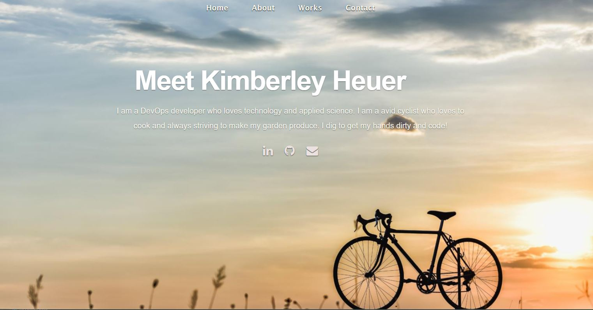

# Unite 20 Project Portfolio-React
## kheuer-protfolio

 

Given the opportunity to rebuild my portfolio with React, I've redesign the original portfolio to a new and modern presentation.  With React the components are reusable and replaceable.  Portfolio data is kept in a json file and can be updated at a later time allowing the site to be current. 

## Includes

* Updated portfolio featuring 6 total projects

* Use React

* Portfolio data is stored in a json file, `portfolio.json` that can be updated at with new projects data.  This allow the site to display current information without having to redeploy.

### React

* A `Header` and `Navbar` component that appears on multiple pages

* A single `Project` component that will be used multiple times on a single page 

* A single `WorkCard` component that will be used multiple times on a single page.  This component represents projects in card format

* Navigation with React Router, dynamic rendering, or another third part router

* A `Footer` component that appears on multiple pages

* Update GitHub profile with pinned repositories featuring those same projects

* Deploy this site to GitHub Pages using the [Create React App docs for deployment.](https://create-react-app.dev/docs/deployment/#github-pages)

## Contents

* [Updated Portfolio](#updated-portfolio)

* [Design](#design)

* [React](#react)

### Updated Portfolio

Has:

* Links to GitHub profile & LinkedIn page as well as your email address and phone number

* A link to a PDF of your resume with updated projects

* A list of projects. For each project, make sure you have the following:

  * Project title

  * Link to the deployed version

  * Link to the GitHub repository

  

  

# Reference Materials
## Getting Started with Create React App

This project was bootstrapped with [Create React App](https://github.com/facebook/create-react-app).

## Available Scripts

In the project directory, you can run:

### `npm start`

Runs the app in the development mode.\
Open [http://localhost:3000](http://localhost:3000) to view it in the browser.

The page will reload if you make edits.\
You will also see any lint errors in the console.

### `npm test`

Launches the test runner in the interactive watch mode.\
See the section about [running tests](https://facebook.github.io/create-react-app/docs/running-tests) for more information.

### `npm run build`

Builds the app for production to the `build` folder.\
It correctly bundles React in production mode and optimizes the build for the best performance.

The build is minified and the filenames include the hashes.\
Your app is ready to be deployed!

See the section about [deployment](https://facebook.github.io/create-react-app/docs/deployment) for more information.

* **Important**: If you use React Router, you will **NOT** be able to use the `<BrowserRouter>` component on GitHub Pages. Read the [GitHub note on client-side routing](https://create-react-app.dev/docs/deployment/#notes-on-client-side-routing) and the [React Router documentation on HashRouter](https://reactrouter.com/web/api/HashRouter) for more information.

### `npm run eject`

**Note: this is a one-way operation. Once you `eject`, you can’t go back!**

If you aren’t satisfied with the build tool and configuration choices, you can `eject` at any time. This command will remove the single build dependency from your project.

Instead, it will copy all the configuration files and the transitive dependencies (webpack, Babel, ESLint, etc) right into your project so you have full control over them. All of the commands except `eject` will still work, but they will point to the copied scripts so you can tweak them. At this point you’re on your own.

You don’t have to ever use `eject`. The curated feature set is suitable for small and middle deployments, and you shouldn’t feel obligated to use this feature. However we understand that this tool wouldn’t be useful if you couldn’t customize it when you are ready for it.

## Learn More

You can learn more in the [Create React App documentation](https://facebook.github.io/create-react-app/docs/getting-started).

To learn React, check out the [React documentation](https://reactjs.org/).

### Code Splitting

This section has moved here: [https://facebook.github.io/create-react-app/docs/code-splitting](https://facebook.github.io/create-react-app/docs/code-splitting)

### Analyzing the Bundle Size

This section has moved here: [https://facebook.github.io/create-react-app/docs/analyzing-the-bundle-size](https://facebook.github.io/create-react-app/docs/analyzing-the-bundle-size)

### Making a Progressive Web App

This section has moved here: [https://facebook.github.io/create-react-app/docs/making-a-progressive-web-app](https://facebook.github.io/create-react-app/docs/making-a-progressive-web-app)

### Advanced Configuration

This section has moved here: [https://facebook.github.io/create-react-app/docs/advanced-configuration](https://facebook.github.io/create-react-app/docs/advanced-configuration)

### Deployment

This section has moved here: [https://facebook.github.io/create-react-app/docs/deployment](https://facebook.github.io/create-react-app/docs/deployment)

### `npm run build` fails to minify

This section has moved here: [https://facebook.github.io/create-react-app/docs/troubleshooting#npm-run-build-fails-to-minify](https://facebook.github.io/create-react-app/docs/troubleshooting#npm-run-build-fails-to-minify)
